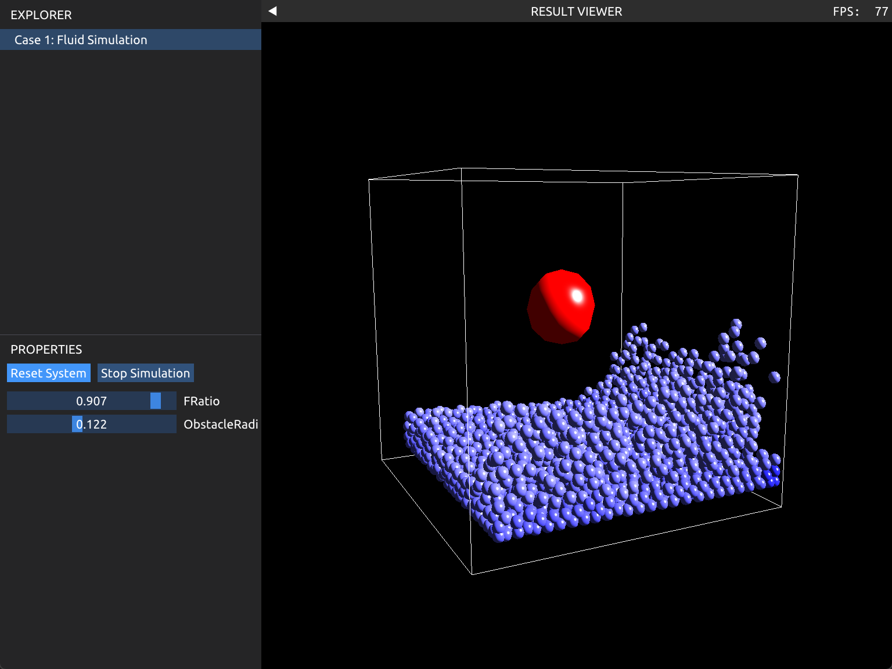
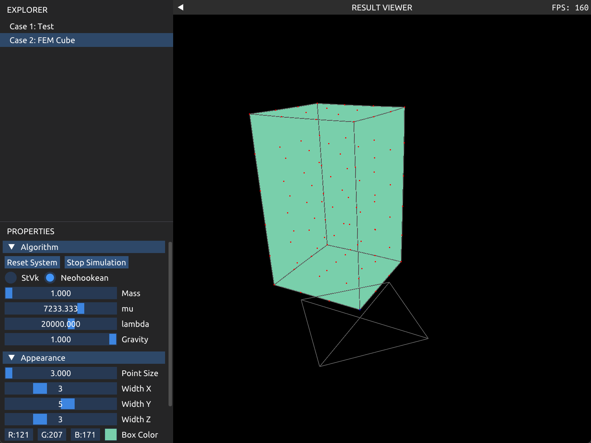
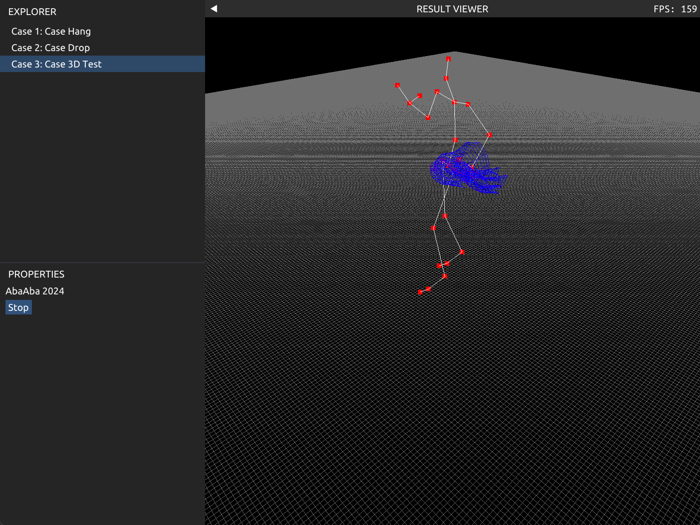

# 图形学物理仿真

实现了刚体仿真（lab1）、流体仿真（lab2）和软体仿真（lab3）

final project 结合了 BVHLoader 和 [FEM](https://tiantianliu.cn/papers/liu13fast/liu13fast.html)

目前似乎 lab1 跑不了？ QAQ


## How to run

```
xmake && xmake run
```

如果要跑其他 lab，需要在 xmake.lua 文件里面把对应的项目取消注释。

## Lab2

## Lab3

## Lab4
